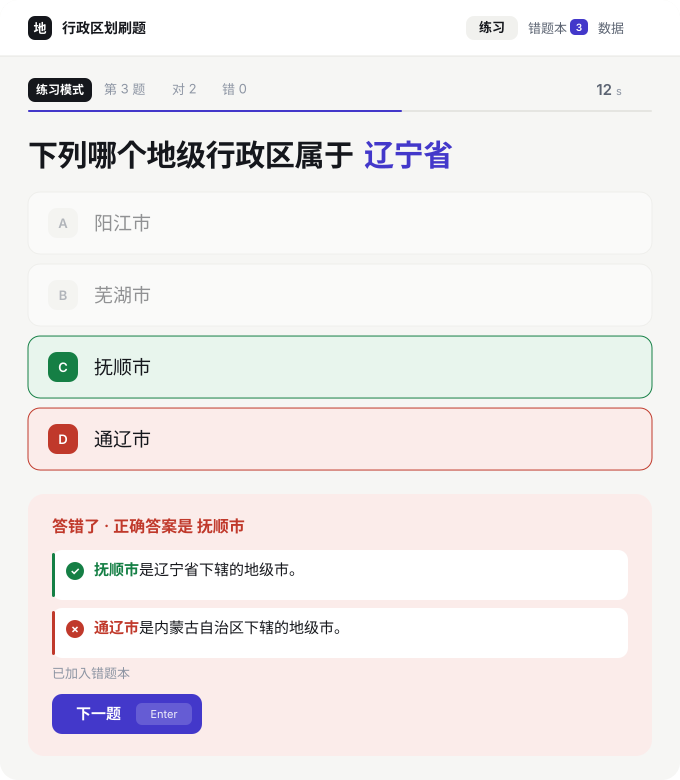
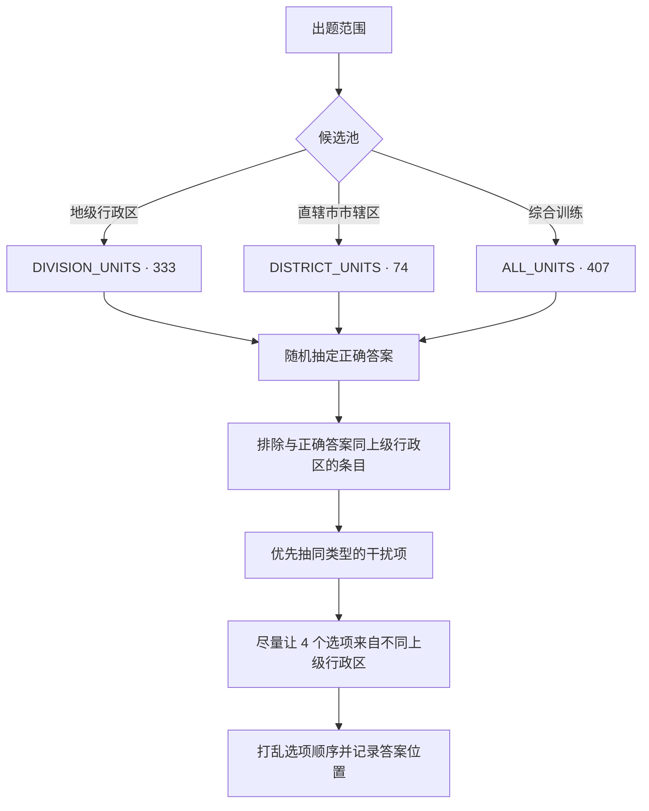
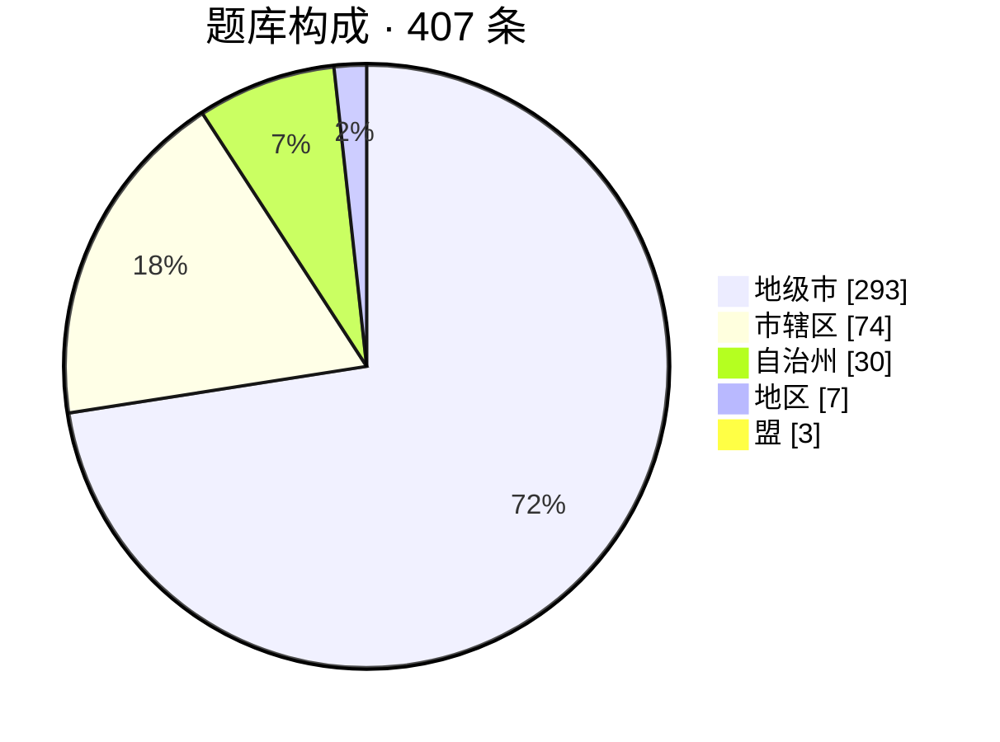

<div align="center">

# 行政区划刷题

选出属于指定省级行政区的**地级行政区**或**直辖市市辖区**


</div>

---

## 这是什么

一个用来刷中国行政区划的单选题训练器。每道题给一个省级行政区，从 4 个选项里选出真正属于它的那个行政区。题库完全离线内置，答错的题自动进入错题本，可以按上级行政区看自己的正确率。

界面预览（答错时的反馈：绿色为正确项解析，红色为你选错的项解析）



---

## 功能

- **两类题型**：地级行政区（地级市 / 自治州 / 地区 / 盟）、直辖市市辖区，可在首页切换出题范围
- **三种模式**：练习模式、限时挑战（全卷 60 秒极速连答，答错会停留并显示解析）、错题重刷
- **每题限时**：不限时 / 20 秒 / 30 秒（默认 30 秒），超时按答错计并同样进入错题本
- **双条解析**：答错时同时给出正确项与所选错项的解析，一眼看清「它到底属于谁」
- **连击反馈**：连续答对时累加连对数并弹动提示，答错即清零，结算页给出本轮最高连对
- **本轮复盘**：结算页列出本轮错过的每一道题，标明正确答案与你所选，直接对照解析
- **错题本**：答错或超时自动收录，重刷答对后自动移出，按错误次数排序，每条错题直接展开双条解析
- **题库覆盖**：首页进度条显示「已掌握 N / 407 题」，答对过一次即计入，用来推动自己刷完全库
- **成绩统计**：累计题量、正确率、最佳连对、挑战纪录，以及按上级行政区拆分的正确率
- **中断续答**：进行中的一轮会写入本地，刷新或误关页面后回到原题继续
- **备份恢复**：数据页可把统计、错题本与设置导出为 JSON，换设备后导入恢复
- **外观**：跟随系统 / 浅色 / 深色三档主题（收在首页「更多设置」里），背景为多层柔和光晕，深色模式适合夜间练习
- **适配小屏**：手机上自动隐藏键盘操作提示，选项与按钮提供足够点击区域
- **键盘操作**：`A`–`D` 或 `1`–`4` 作答，`Enter` 进入下一题（挑战模式答错时可跳过等待）
- **零依赖后端**：所有数据存在浏览器 localStorage，不需要服务器，清除浏览器数据才会清空

---

## 出题范围与模式

| 出题范围 | 候选池 | 题干预览 |
| --- | --- | --- |
| 地级行政区 | 333 条 | 下列哪个**地级行政区**属于浙江省 |
| 直辖市市辖区 | 74 条 | 下列哪个**市辖区**属于重庆市 |
| 综合训练 | 407 条 | 按题库规模混出，地级行政区题目占比更高 |

| 模式 | 规则 |
| --- | --- |
| 练习模式 | 不限题数，按首页「更多设置」里的每题限时逐题作答，答完可看解析 |
| 限时挑战 | 全卷共用 60 秒倒计时（不是每题 60 秒），答对 0.4 秒后自动进入下一题；答错则停留 2 秒展示解析，按 `Enter` 可提前跳过，结束后结算答对题数 |
| 错题重刷 | 按错误次数从多到少依次重出，答对即移出错题本 |

---

## 出题规则

干扰项不是随便抽的，保证每道题的四个选项都经得起推敲。



- **同题型约束**：市辖区题的 3 个干扰项只从市辖区里抽，绝不会混进地级市，4 个选项因此必然来自 4 个不同直辖市
- **同类优先**：地级行政区题优先抽取同为地级市 / 自治州 / 地区 / 盟的条目，避免「三个地级市 + 一个自治州」这种一眼可排除的送分题
- **不同上级行政区**：干扰项先尝试来自与正确答案不同的省级行政区，不足时才回落补齐

---

## 题库口径

题库依据《中华人民共和国行政区划代码》（GB/T 2260）编写，总计 407 条。



| 分组 | 数量 | 说明 |
| --- | --- | --- |
| 省级行政区 | 27 | 22 省 + 5 自治区 |
| 地级行政区 | 333 | 293 地级市 + 30 自治州 + 7 地区 + 3 盟 |
| 直辖市市辖区 | 74 | 北京 16 + 天津 16 + 上海 16 + 重庆 26 |

补充说明：

- 北京、天津、上海、重庆 4 个直辖市以及香港、澳门 2 个特别行政区**不设地级行政区**，因此只参与市辖区题型，不出现在地级行政区题库中
- 重庆仅收录 **26 个市辖区**，其下辖的 8 个县（城口、丰都、垫江、忠县、云阳、奉节、巫山、巫溪）与 4 个自治县（石柱、秀山、酉阳、彭水）不属于市辖区，未纳入题库
- 省直辖县级行政区（如济源市、石河子市）不在「地级行政区」层级内，同样不计入

---

## 快速开始

```bash
npm install
npm run dev       # 开发模式：http://localhost:5173/xiaoce/
```

其他命令：

```bash
npm run build     # 产出静态文件到 dist/
npm run preview   # 本地预览构建结果
```

构建产物是纯静态文件，丢到任意静态托管即可运行，不需要服务器端逻辑。

注意开发地址带 `/xiaoce/` 前缀：因为要部署在 GitHub Pages 的项目页子路径下，[vite.config.js](vite.config.js) 里设置了 `base: '/xiaoce/'`。如果本地打开 `http://localhost:5173/` 是空白页，补上这个前缀即可。

---

## 部署到 GitHub Pages

仓库已带自动部署配置，推送到 `main` 即可发布。

1. GitHub Actions 工作流会在 push 到 `main`（或在 Actions 页手动触发）时执行 `npm ci` → `npm run build`，再把 `dist/` 发布到 Pages
2. 在仓库 **Settings → Pages → Build and deployment → Source** 中选择 **GitHub Actions**（只需设置一次）
3. 推送后访问 `https://<用户名>.github.io/<仓库名>/`

注意两点：

- **`base` 必须与仓库名一致**。项目页部署在 `/<仓库名>/` 子路径下，若 `base` 仍为 `'/'`，JS / CSS 会从根路径加载而 404，页面白屏
- 如果改用自定义域名，或部署到 `<用户名>.github.io` 用户主页，把 `base` 改回 `'/'`

不要直接部署仓库根目录的 [index.html](index.html)：那是 Vite 的开发入口模板，靠浏览器原生 ESM 加载 `/src/main.jsx`，不经构建在浏览器里跑不起来，同样表现为白屏。要部署的是构建产物 `dist/`。

---

## 项目结构

```text
src/
├── App.jsx                  # 会话状态机、计时器、主题应用、统计与错题本副作用
├── main.jsx                 # 入口
├── styles.css               # 全部样式与深浅两套主题变量
├── data/
│   └── divisions.js         # 题库数据、类别判定、候选池与索引
├── lib/
│   ├── quiz.js              # 出题、干扰项挑选、解析文案
│   └── storage.js           # localStorage 读写、会话恢复、备份导出与解析
└── components/
    ├── SetupView.jsx        # 首页：出题范围、更多设置、成绩仪表盘与题库覆盖进度
    ├── QuizView.jsx         # 答题页：题干、选项、计时、反馈与解析
    ├── ResultView.jsx       # 单次结算与本轮错题回顾
    ├── WrongBookView.jsx    # 错题本
    └── StatsView.jsx        # 数据页：累计指标、按上级行政区拆分、备份
docs/
└── preview.svg              # README 界面示意图
.github/workflows/
└── deploy.yml               # 推送到 main 自动构建并发布到 GitHub Pages
vite.config.js               # base 子路径与开发端口
```

---

## 技术要点

- **纯前端**：无后端、无网络请求，React 19 + Vite 7，除 react / react-dom 外无运行时依赖
- **统一的行政区抽象**：所有条目都归一为 `{ name, province, scope }`，两类题型共用同一套出题、干扰项与解析逻辑，不分叉
- **按名称反查**：407 条行政区名称全局唯一，因此错题本只存名称，重刷时通过 `UNIT_INDEX` 反查出上级行政区与题型，无需在存储里冗余字段
- **答题幂等**：`answeredRef` 保证同一题只计分一次，避免点击与超时落在同一帧造成重复计数
- **计时器读取最新状态**：计时相关 effect 通过 `sessionRef` 镜像读取最新会话，规避闭包读到旧值的问题
- **主题只维护两套变量**：「跟随系统」由 JS 读 `matchMedia` 解析成具体值后写到 `documentElement.dataset.theme`，CSS 里只有 `:root` 与 `:root[data-theme='dark']`，不用 media query 再重复定义一遍颜色
- **子路径部署**：`base: '/xiaoce/'` 让构建产物直接可用在 GitHub Pages 项目页下，无需额外改写资源路径

---

## 数据存储

所有数据都保存在浏览器 localStorage，清除浏览器数据会一并清空；换浏览器或换设备不会同步。

| Key | 内容 |
| --- | --- |
| `xiaoce.stats.v1` | 累计题量、正确数、最佳连对、挑战纪录、按上级行政区的分布，以及已掌握的行政区集合 |
| `xiaoce.wrong.v1` | 错题条目：行政区、上级行政区、错误次数、最近错误时间，以及最近一次错选的行政区 |
| `xiaoce.settings.v1` | 出题范围、每题限时、外观主题 |
| `xiaoce.session.v1` | 进行中的一轮答题（答题中途刷新时据此恢复） |

在「数据」页可以清零统计，在「错题本」页可以清空错题，两者互不影响；「数据」页还支持把三者一并导出为 JSON 备份、在其他设备导入恢复。

---

## 更新记录

**0.4**

- 首页重构：出题范围横向平铺，「每题限时」与「外观」折叠进「更多设置」，成绩改为仪表盘卡片移入主区域，「重刷错题」由文字链升级为带数量的实体按钮
- 新增连击反馈：连续答对时累加连对数并弹动提示，答错清零，结算页给出本轮最高连对
- 新增题库覆盖进度：首页进度条显示「已掌握 N / 407 题」，答对过一次即计入
- 错题本改为直接展开双条解析，不必逐条点击；错题条目会记下最近一次错选的行政区
- 明确两种玩法的差异：「限时挑战」为全卷 60 秒并标注「极速 60s」；「两者混合」更名为「综合训练」
- 提高次级提示文案对比度，深色模式下的说明文字与 13px 提示均达到 WCAG AA
- 「已掌握」是本版新增字段，历史统计没有逐题数据、无法回填，升级后从 0 开始累计（已答与正确率不受影响）

**0.3**

- 新增深色模式（跟随系统 / 浅色 / 深色），背景改为多层柔和径向渐变，顶栏改为吸顶毛玻璃，反馈块改为描边 + 左侧色条
- 限时挑战答错时也会显示解析（答对仍快速跳过），结算页新增本轮错题回顾
- 答题中途刷新或误关页面后可继续本轮，不再丢失进度
- 数据页新增导出 / 导入备份，默认每题限时由 20 秒放宽为 30 秒
- 配置 GitHub Pages 自动部署：`base: '/xiaoce/'` 子路径 + Actions 工作流；完善 README 部署与结构说明

**0.2**

- 新增直辖市市辖区题型与首页「出题范围」开关
- 答错时改为「正确项 + 错选项」双条解析，绿色 / 红色区分
- 修正 `divisionKind` 对市辖区的类别判定，修正数据页遗漏直辖市数据的问题

**0.1**

- 地级行政区题型，练习模式 / 限时挑战 / 错题重刷
- 错题本、成绩统计、每题限时与键盘操作